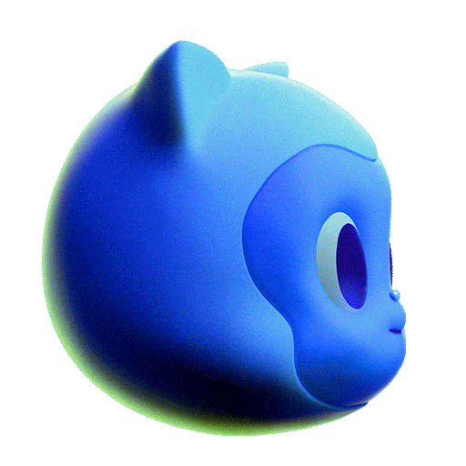

<!-- logo IMG -->
<p align="center">
  
</p>


<!-- code IMG -->
<details >
<summary align="center">👾 Click-Code ... 👾</summary>

```
<p align="center">
  
</p>
```
</details>


<!-- Version - Social Media - ect -->
<div align="center">
<!-- CI -->
  <a href="https://github.com/bastndev/ShopyScan/actions/new">
   
  </a>
<!-- Version -->  
  </a href="#">
     
  </a>
<!-- Version Android -->
  <a href="#">
    
  </a>
<!-- Version iOS -->
  <a href="#">
    
  </a> 

 [▶ Page Link ](https://shields.io/)
</div>

<!-- TITLE -->
# Markdown 24 
``` code:
# Markdown 24 
```
## Markdown 24 
``` code:
## Markdown 24
```
### Markdown 24 
``` code:
### Markdown 24
```
#### Markdown 24 
``` code:
#### Markdown 24
```

<!-- --- -->


**Caption** ⤵
``` code:
**Caption**
```
***slanted text*** ⤵
``` code:
***slanted text***
```
~~Strikethrough text~~ ⤵
``` code:
~~Strikethrough text~~
```
`marked text` ⤵
```
`marked text`
```
> block quote ⤵
```
> block quote
```
>- Text with dot ⤵
```
>- Text with dot
```
 * Bullet list
      * Nested bullet
          * Sub-nested bullet etc ⤵
```
 * Bullet list
      * Nested bullet
          * Sub-nested bullet etc
```


[Page Link](http://www.bastndev.com/) ⤵
```
[Named Link](http://www.bastndev.com/)
```
[Page Link](http://www.bastndev.com/ "Named link title") and http://www.example.com/ or <http://example2.com/> ⤵
```
[Page Link](http://www.bastndev.com/ "Named link title") and http://www.example.com/ or <http://example2.com/>
```
<!-- --- -->


1. A numbered list
    1. A nested numbered list
    2. Which is numbered
```
1. A numbered list
    1. A nested numbered list
    2. Which is numbered
```

- [ ] An uncompleted task
- [X] A completed task
- [X] ~~An uncompleted task~~
```
- [ ] An uncompleted task
- [X] A completed task
- [X] ~~An uncompleted task~~
```

- [ ] [[■■■■□□□□□□] 40%](https://www.tiktok.com/@bastndev)
    - [ ] A subtask
        - [X] ~~A subtask~~
```
- [ ] An uncompleted task
    - [ ] A subtask
        - [X] ~~A subtask~~
```

<details>
  <summary>Title 1</summary>
    <p>Content 1 Content 1 Content 1 Content 1 Content 1</p>
</details>

```
<details>
  <summary>Title 1</summary>
    <p>Content 1 Content 1 Content 1 Content 1 Content 1</p>
</details>
```

<!-- --- -->


  
```
  
```

| First Header | Second Header |
|--------------|---------------|
| Content Cell | Content Cell  |
| Content Cell | Content Cell  |

```
| First Header | Second Header |
|--------------|---------------|
| Content Cell | Content Cell  |
| Content Cell | Content Cell  |
```

| Left aligned Header | Right aligned Header | Center aligned Header |
|:--------------------|---------------------:|:---------------------:|
| Content Cell        |         Content Cell |     Content Cell      |
| Content Cell        |         Content Cell |     Content Cell      |
| Content Cell        |         Content Cell |     Content Cell      |
```
| Left aligned Header | Right aligned Header | Center aligned Header |
|:--------------------|---------------------:|:---------------------:|
| Content Cell        |         Content Cell |     Content Cell      |
| Content Cell        |         Content Cell |     Content Cell      |
| Content Cell        |         Content Cell |     Content Cell      |
```

<!-- PIcture in table -->
<table align="center">
<tr>
  <td align="center"><a href="https://github.com/bastndev"><br /><sub><b>  Gohit Bastian </b></sub></a><br/><a href="#maintenance-tbenning" title="Maintenance"></a></td>
  
  <td align="center"><a href="https://github.com/bastndev"><br/><sub><b>👽 @bastndev </b></sub></a><br /><a href="#maintenance-tbenning" title="Maintenance"></a></td>
</tr>
</table> 

```
<table align="center">
<tr>
  <td align="center"><a href="https://github.com/bastndev"><br /><sub><b>  Gohit Bastian </b></sub></a><br/><a href="#maintenance-tbenning" title="Maintenance"></a></td>
  
  <td align="center"><a href="https://github.com/bastndev"><br/><sub><b>👽 @bastndev </b></sub></a><br /><a href="#maintenance-tbenning" title="Maintenance"></a></td>
</tr>
</table> 
```

|  |       |   |
|:--------------------------------:|:-----------------------------------------:|:------------------------------------:|
|   |  |  |
```
|  |  |  |
|:-------------------------------------:|:-----------------------------------------:|:----------------------------------------:|
|        |  |      |

```

<!-- TODO: NO HACER COMMIT!!! -->

<!-- BEGIN YOUTUBE-CARDS -->
[](https://www.youtube.com/watch?v=NfEbacIEtWY)
[](https://www.youtube.com/watch?v=wVZ_lUYga8M)
[](https://www.youtube.com/watch?v=X86ozDqT32w)
[](https://www.youtube.com/watch?v=BKTILpP4KqI)
[ 2023")](https://www.youtube.com/watch?v=QX1myYCP76E)
[](https://www.youtube.com/watch?v=yazwAvXewk4)
<!-- END YOUTUBE-CARDS -->

<table style="width:100%">  
<td>
<a href="https://www.youtube.com/watch?v=QX1myYCP76E&ab_channel=BastianDev">
</a>
</td>

<td>
<a href="https://www.youtube.com/watch?v=VdsJeyRhSWw">
</a>
</td>

<td>
<a href="https://www.youtube.com/watch?v=a6JQkAxYf3A&t=119s&ab_channel=BastianDev">
</a>
</td>
</table>

```
<table style="width:100%">  
<td>
<a href="https://www.youtube.com/watch?v=QX1myYCP76E&ab_channel=BastianDev">
</a>
</td>

<td>
<a href="https://www.youtube.com/watch?v=VdsJeyRhSWw">
</a>
</td>

<td>
<a href="https://www.youtube.com/watch?v=a6JQkAxYf3A&t=119s&ab_channel=BastianDev">
</a>
</td>
</table>
```